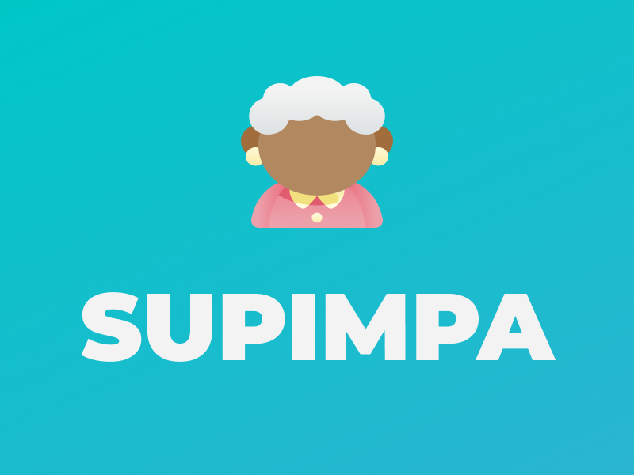

<h1 align="center">
    
</h1>

## Projeto

Supimpa é uma aplicação para cadastrar casas de repouso e centro de convivência para idosos.

## Demonstração

- [Vídeo da aplicação](https://www.youtube.com/watch?v=smu-UUQzPcg)

## Tecnologias

Esse projeto foi desenvolvido com as seguintes tecnologias:

- React
- React-router-dom
- Styled-components
- Axios
- Leaflet
- Polished
- Mapbox
- React-lottie
- React-modal
- React-icons
- ESLint
- Prettier
- Typescript

Foram usadas as seguintes APIs:

- [OpenCage](https://opencagedata.com/)
- [IBGE](https://servicodados.ibge.gov.br/api/docs)
- [Supimpa-api](https://github.com/gmcotta/supimpa-api)

## Como rodar localmente

- Faça o clone esse repositório:

```
git clone https://github.com/gmcotta/supimpa-web.git
```
- Abra seu terminal na pasta gerada

- Caso tenha o [Yarn](https://yarnpkg.com/) instalado, digite o comando:

```
yarn
```

- Duplique o arquivo ```.env.example``` e renomeie para ```.env```

- Faça o cadastro no site da [OpenCage](https://opencagedata.com/) e na [Mapbox](https://www.mapbox.com/). Os dois sites possuem um plano gratuito.

- No site da OpenCage, faça o log in, acesse [esse link](https://opencagedata.com/dashboard#api-keys), copie a API key e cole no campo ```REACT_APP_OPENCAGEDATA_TOKEN``` do arquivo ```.env```

- Nos site da Mapbox, faça o log in, acesse [esse link](https://account.mapbox.com/), desca até o card de token de acesso, copie o token e cole no campo ```REACT_APP_MAPBOX_TOKEN``` do arquivo ```.env```

- Verifique se não há nenhuma aplicação usando a porta 3000. Caso não tenha, digite o comando:

```
yarn start
```

## Outras informações

Para mais informações sobre as ferramentas utilizadas, acesse os seguintes repositórios:

- [Back-end](https://github.com/gmcotta/supimpa-api)
- [Mobile](https://github.com/gmcotta/supimpa-mobile)
